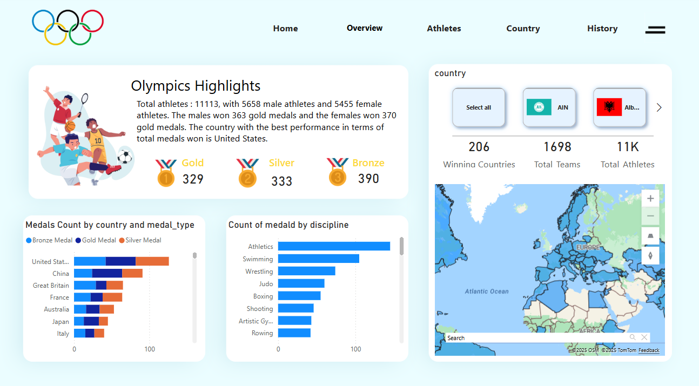
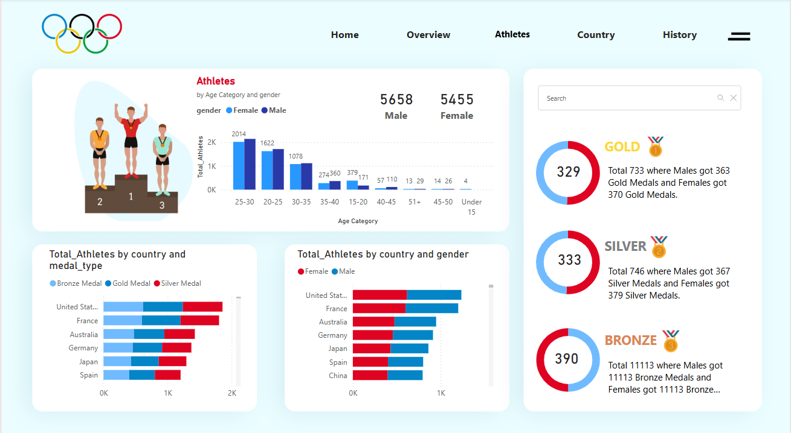
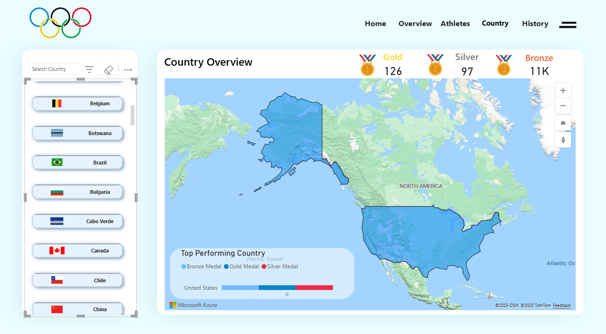

# Paris Olympics Data Engineering Project in Microsoft Azure 🏅
## Overview 📝
This project demonstrates an end-to-end ETL process for analyzing Olympics data using Microsoft Azure services: Azure Data Factory, Azure Databricks, Azure Storage, and Azure Synapse Analytics. The dataset includes four tables: Athletes, Coaches, Teams, and Medals.

## Components Used ⚙️
1. Azure Data Factory 🏭
Orchestrated the ETL pipeline by extracting data from Azure Storage, transforming it in Databricks, and loading it into Azure Synapse Analytics.

2. Azure Databricks 🔥
Handled data transformation and analysis using PySpark. The cleaned and processed data was prepared for deeper insights, such as athlete performance trends and medal distributions.

3. Azure Storage 📦
Stored the raw Olympics data (CSV files) as the source for the pipeline.

4. Azure Synapse Analytics 📊
Served as the data warehouse, allowing complex SQL queries for team performance and medal analysis.

## Dataset 📚
The dataset includes:
> - **Athletes**
> - **Coaches**
> - **Teams**
> - **Medals**

It can be found on kaggle - "https://www.kaggle.com/datasets/piterfm/paris-2024-olympic-summer-games/data"

## Work 🎯

https://github.com/user-attachments/assets/7320647c-7230-4502-9a48-660f9afd45b1

# My PowerBI Dashboard

This is a link to my live PowerBI dashboard. Click the image below to open it:

---

